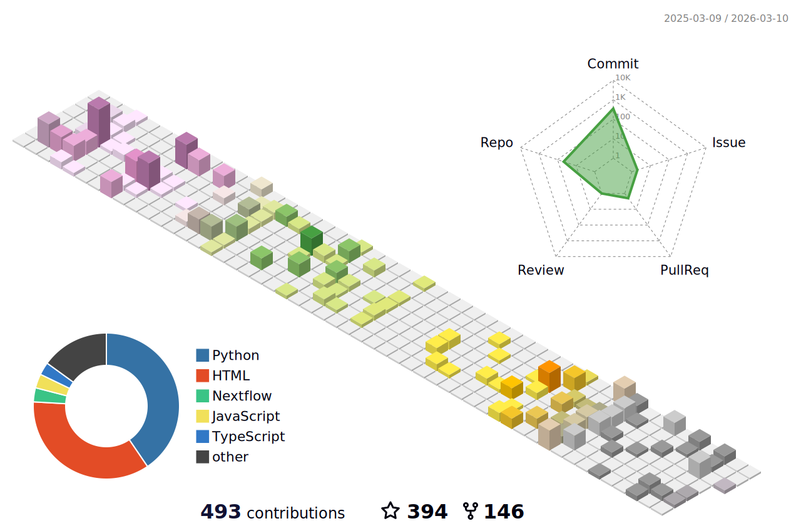

# 
👋 Hello World, I'm Panda 🐼

  

  
  
  
  
  
  

  <i>Analysis, I believe, is key to any protocol. We as a community have tons of data lying around, which must be made sense of.</i>

 

## 🔬 About Me

- 🏛️ **Postdoctoral Scholar** at [Stanford University School of Medicine](https://profiles.stanford.edu/pritam-panda) in the Department of Anesthesiology, Perioperative, and Pain Medicine
  
- 🧪 **Research Focus:** Designing novel anesthetics for battlefield conditions using AI-driven protein design and high-throughput virtual screening
  
- 🌐 **Portfolio:** [Atom Odyssey](https://www.atomodyssey.com)
  
- 🚀 **Roles:** [Nextflow Ambassador](https://www.nextflow.io/our_ambassadors.html) and member of Sigma Xi: The Scientific Research Honor Society
  
- 👯 **Collaboration Interests:** Bioinformatics projects (NGS, Drug discovery Pipelines, AI-based protein modeling)
  
- 🤝 **Looking For Help With:** Frontend/backend development
  
- 💬 **Expertise Areas:** R, Python, NGS, Siesta, Gromacs, Molecular docking/dynamics
  
- 📫 **Contact:** [Stanford Medicine Profile](https://med.stanford.edu/profiles/pritam-panda)
  
- 🎮 **Fun fact:** I love gaming

 

## 🏆 GitHub Achievements

  

 

## 📊 GitHub Stats

  
  

  

 

## 🧠 Skills & Tools

  
### 💻 Programming Languages
  

### 📊 Data Science & Machine Learning
  

### ☁️ Cloud & DevOps
  

### 🌐 Web Development
  

### 🎨 Design & Creative
  

### 💾 Databases
  

  

 

## 📺 Latest YouTube Videos

  

 

## 🤝 Top Contributed Repositories

  

 

## 👁️ Profile Visualization

  

 

## ☕ Support My Work

  

 

## ⏰ Time Spent Here

  

 

  <i>Thanks for visiting my profile! Have a great day! 😊</i>

