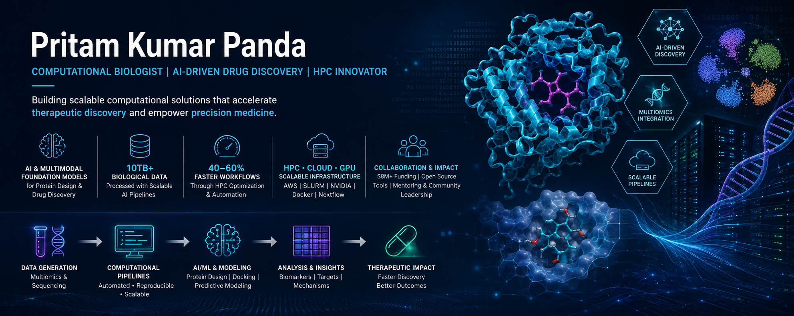
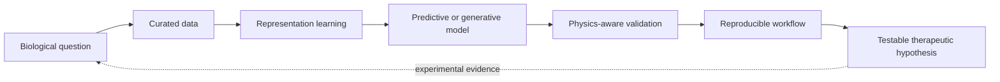

## Hello, I’m Pritam 👋

I’m a bioinformatician and AI research scientist at **Stanford University School of Medicine**, working where deep learning, molecular modeling, and scientific software meet. My research focuses on AI-driven protein design and computational drug discovery—including safer anesthetic candidates for field and battlefield medicine.

I build end-to-end research systems: from foundation models, graph neural networks, and molecular simulation to reproducible pipelines, evaluation frameworks, and tools scientists can actually use. Over 8+ years, my work has crossed computational biology, clinical genomics, high-performance computing, and open-source engineering.

> **Research north star:** compress the distance between a promising biological idea and a testable therapeutic hypothesis.

### What I’m exploring now

-  Generative and predictive models for protein structure and function
-  Structure-based drug design, molecular docking, and ADMET intelligence
-  Biomedical knowledge graphs, RAG, and evidence-grounded scientific agents
-  Reproducible, scalable pipelines for multi-omics and high-throughput discovery
-  Honest benchmarks that distinguish model performance from scientific utility

## Flagship open-source work

<table>
  <tr>
    <td width="50%" valign="top">
      <h3><a href="https://github.com/pritampanda15/PandaDock">🐼 PandaDock</a></h3>
      
Physics-based molecular docking with flexible-ligand search and SE(3)-equivariant GNN rescoring.

      
<b>Research signal:</b> Pearson R = 0.88 on the PDBbind refined set; reproducible search, rich interaction analysis, and publication-ready reports.

      
      
      
    </td>
    <td width="50%" valign="top">
      <h3><a href="https://github.com/pritampanda15/Seqcore">⚡ Seqcore</a></h3>
      
A unified, GPU-accelerated Python library for biological sequence analysis across genomics, proteomics, structural biology, and drug design.

      
<b>Design goal:</b> one fast, composable interface for sequence-heavy scientific workflows.

      
      
      
    </td>
  </tr>
  <tr>
    <td width="50%" valign="top">
      <h3><a href="https://github.com/pritampanda15/ADMET-Prediction-System-Graph-Neural-Networks-with-RAG">🧪 ADMET Intelligence</a></h3>
      
Graph neural networks predict molecular ADMET properties while a RAG-based explainer connects predictions to mechanistic context.

      
<code>GNN</code> <code>RAG</code> <code>Molecular ML</code> <code>Explainability</code>

    </td>
    <td width="50%" valign="top">
      <h3><a href="https://github.com/pritampanda15/Drug-Repurposing-Intelligence-System">🔎 Drug Repurposing Intelligence</a></h3>
      
R-GCNs and biomedical knowledge graphs uncover drug–disease relationships, paired with evidence-aware natural-language explanations.

      
<code>Knowledge Graphs</code> <code>R-GCN</code> <code>NLP</code> <code>RAG</code>

    </td>
  </tr>
  <tr>
    <td width="50%" valign="top">
      <h3><a href="https://github.com/pritampanda15/Oncology-Drug-Response-Prediction-System_DL-RAG">🎯 Oncology Drug Response</a></h3>
      
Deep-learning clinical decision support for predicting cancer cell-line drug response with context-specific RAG explanations.

    </td>
    <td width="50%" valign="top">
      <h3><a href="https://github.com/pritampanda15/Literature-Intelligence">📚 Literature Intelligence</a></h3>
      
Tracks and analyzes PubMed and bioRxiv literature for drug targets, compounds, and therapeutic areas.

    </td>
  </tr>
</table>

  <a href="https://github.com/pritampanda15?tab=repositories"><b>Explore all repositories →</b></a>

## Research-to-software pipeline

```mermaid
flowchart LR
    A[Biological question] --> B[Curated data]
    B --> C[Representation learning]
    C --> D[Predictive or generative model]
    D --> E[Physics-aware validation]
    E --> F[Reproducible workflow]
    F --> G[Testable therapeutic hypothesis]
    G -. experimental evidence .-> A
```

## Technical ecosystem

**AI & scientific computing**

**Scientific workflows & infrastructure**

**Molecular & biomedical systems**

## GitHub analytics

  <picture>
    <source media="(prefers-color-scheme: dark)" srcset="https://github-readme-stats.vercel.app/api?username=pritampanda15&show_icons=true&rank_icon=percentile&include_all_commits=true&theme=github_dark&hide_border=true&bg_color=00000000">
    <source media="(prefers-color-scheme: light)" srcset="https://github-readme-stats.vercel.app/api?username=pritampanda15&show_icons=true&rank_icon=percentile&include_all_commits=true&theme=default&hide_border=true">
    
  </picture>
  <picture>
    <source media="(prefers-color-scheme: dark)" srcset="https://github-readme-stats.vercel.app/api/top-langs/?username=pritampanda15&layout=compact&langs_count=8&theme=github_dark&hide_border=true&bg_color=00000000">
    <source media="(prefers-color-scheme: light)" srcset="https://github-readme-stats.vercel.app/api/top-langs/?username=pritampanda15&layout=compact&langs_count=8&theme=default&hide_border=true">
    
  </picture>

  <picture>
    <source media="(prefers-color-scheme: dark)" srcset="https://streak-stats.demolab.com?user=pritampanda15&theme=github-dark-blue&hide_border=true&background=00000000">
    <source media="(prefers-color-scheme: light)" srcset="https://streak-stats.demolab.com?user=pritampanda15&theme=default&hide_border=true">
    
  </picture>

  

<b>Deep-dive metrics dashboard</b>

 

<!-- Generated daily by .github/workflows/metrics.yml -->

<b>Contribution map</b>

 

<picture>
  <source media="(prefers-color-scheme: dark)" srcset="https://raw.githubusercontent.com/pritampanda15/pritampanda15/output/github-contribution-grid-snake-dark.svg">
  <source media="(prefers-color-scheme: light)" srcset="https://raw.githubusercontent.com/pritampanda15/pritampanda15/output/github-contribution-grid-snake.svg">
  
</picture>

## Selected scholarship & impact

- Published work spanning **AI-enabled drug design, molecular modeling, clinical genomics, nanotherapeutics, and biomolecular simulation**.
- Research experience across Stanford University, Uppsala University, Karolinska Institutet, DKFZ, and University Medical Center Freiburg.
- **Nextflow Ambassador** and Sigma Xi member; builder of educational resources in AI-driven drug discovery, NGS, quantum chemistry, and molecular dynamics.
- Recipient of research and innovation support from Colgate-Palmolive, Uppsala University/ABB–Hitachi, and Karolinska Institutet.

## Let’s build something consequential

I’m open to research collaborations, translational partnerships, and open-source work in:

- AI-driven protein and therapeutic design
- Computational biology and multi-omics infrastructure
- Foundation models and knowledge systems for biology
- Reproducible scientific software and benchmarking

Science moves faster when the tools, evidence, and ideas are open.

