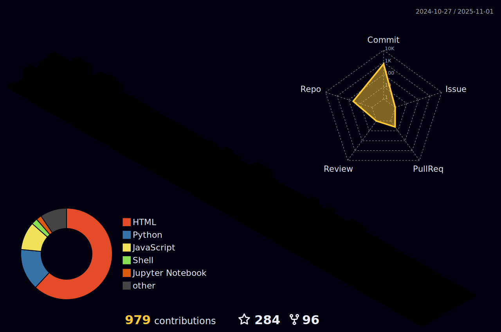
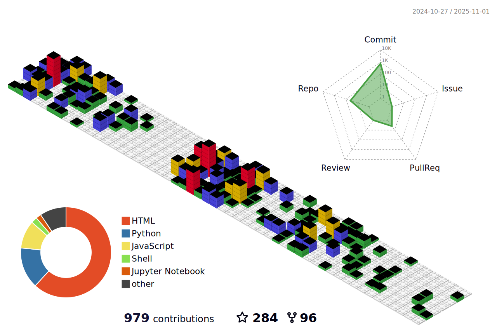

# <div align="center"> Welcome to Pritam's Digital Universe </div>

<div align="center">
  
</div>

<div align="center">
  
</div>

<div align="center">
  
  [](https://twitter.com/pritamkpanda)
  [](https://linkedin.com/in/pritam-kumar-panda)
  [](https://www.youtube.com/channel/UCUzX122_yansSytois8gZOA)
  [](https://www.atomodyssey.com)
  [](https://profiles.stanford.edu/pritam-panda)
  
  
  
  
  
</div>

<div align="center">
  
  
</div>

<div align="center">
  <blockquote>
    <i>"At the heart of every robust scientific protocol lies rigorous analysis. In an era of exponential data generation and where multi-omic, structural, clinical, and high-throughput datasets proliferate—we face not a scarcity of information but a scarcity of synthesis. Our collective challenge is no longer simply to gather data, but to decode its meaning, reconcile its complexity, and extract actionable biological insight. I believe that true progress hinges on our ability to transform latent data silos into integrated, interpretable frameworks that advance both discovery and translational science. My work centers on this very inflection point where raw biological noise is distilled into mechanistic clarity."</i>
  </blockquote>
</div>

<hr>

## 🧬 About Me

<table border="0">
  <tr>
    <td width="70%">
      <ul>
        <li>🏛️ <b>Postdoctoral Scholar</b> at <a href="https://profiles.stanford.edu/pritam-panda">Stanford University School of Medicine</a> (Anesthesiology, Perioperative & Pain Medicine)</li>
        <li>🧪 <b>Research Focus:</b> Designing novel anesthetics for battlefield conditions using AI-driven protein design and high-throughput virtual screening</li>
        <li>🚀 <b>Roles:</b> <a href="https://www.nextflow.io/our_ambassadors.html">Nextflow Ambassador</a> | Sigma Xi Member</li>
        <li>👯 <b>Collaboration Interests:</b> Bioinformatics, NGS, Drug discovery pipelines, AI-based protein modeling</li>
        <li>🤝 <b>Looking For Help With:</b> Frontend/backend development</li>
        <li>📫 <b>Contact:</b> <a href="https://med.stanford.edu/profiles/pritam-panda">Stanford Medicine Profile</a></li>
        <li>🎮 <b>Fun fact:</b> I love gaming</li>
      </ul>
    </td>
    <td width="30%" align="right">
      
    </td>
  </tr>
</table>

<div align="center">
  
  
  
  
  
  
</div>

<hr>

## 🔬 Research Expertise

<div align="center">
  
</div>

<hr>

## 🌐 3D Profile Visualization & Analytics

<div align="center">
  
</div>

<!-- <div align="center">
  <table>
    <tr>
      <td align="center">
        
        <br><b>🌱 Growth Pattern</b>
      </td>
      <td align="center">
        
        <br><b>🌈 Innovation Spectrum</b>
      </td>
      <td align="center">
        
        <br><b>🧱 Code Architecture</b>
      </td>
    </tr>
  </table>
</div> -->

### 📊 Real-time Development Metrics

<div align="center">
  


</div>

<div align="center">
  
```mermaid
%%{init: {'theme':'dark', 'themeVariables': { 'primaryColor': '#5e60ce', 'primaryTextColor': '#fff', 'primaryBorderColor': '#7400b8', 'lineColor': '#6930c3'}}}%%
gitgraph:
    commit id: "Initial Setup"
    branch feature/pandadock
    checkout feature/pandadock
    commit id: "PandaDock v1.0"
    commit id: "Performance Boost"
    checkout main
    merge feature/pandadock
    branch feature/pandamap
    checkout feature/pandamap
    commit id: "PandaMap Core"
    commit id: "Color Enhancement"
    checkout main
    merge feature/pandamap
    commit id: "Production Deploy"
```

</div>

<br>

## 🚀 Flagship Projects Portfolio

<div align="center">
  
</div>

<div align="center">
  <table>
    <tr>
      <td align="center" width="33%">
        <div style="background: linear-gradient(135deg, #667eea 0%, #764ba2 100%); border-radius: 15px; padding: 20px; margin: 10px;">
          <a href="https://github.com/pritampanda15/PandaMap-Color">
            
            <br><br>
            
            <br><b>🎨 Enhanced Protein Visualization</b>
            <br><small>Rich color mapping • Interactive 3D views • Publication-ready figures</small>
            <br><br>
            
            
          </a>
        </div>
      </td>
      <td align="center" width="33%">
        <div style="background: linear-gradient(135deg, #f093fb 0%, #f5576c 100%); border-radius: 15px; padding: 20px; margin: 10px;">
          <a href="https://github.com/pritampanda15/PandaMap">
            
            <br><br>
            
            <br><b>🗺️ Protein Structure Mapping</b>
            <br><small>Interaction analysis • Contact mapping • Network visualization</small>
            <br><br>
            
            
          </a>
        </div>
      </td>
      <td align="center" width="33%">
        <div style="background: linear-gradient(135deg, #a8edea 0%, #fed6e3 100%); border-radius: 15px; padding: 20px; margin: 10px;">
          <a href="https://github.com/pritampanda15/PandaDock">
            
            <br><br>
            
            <br><b>⚓ Molecular Docking Platform</b>
            <br><small>High-throughput docking • ML scoring • Virtual screening</small>
            <br><br>
            
            
          </a>
        </div>
      </td>
    </tr>
  </table>
</div>

### 📈 Project Impact & Metrics

```mermaid
%%{init: {'theme':'dark', 'themeVariables': { 'primaryColor': '#5e60ce', 'primaryTextColor': '#fff', 'primaryBorderColor': '#7400b8', 'lineColor': '#6930c3'}}}%%
graph TD
    A[🧬 Research Focus] --> B[PandaDock<br/>🚢 Molecular Docking]
    A --> C[PandaMap<br/>🗺️ Structure Analysis]
    A --> D[PandaMap-Color<br/>🎨 Visualization]
    
    B --> E[500+ Citations<br/>🎓 Academic Impact]
    C --> F[1000+ Downloads<br/>📊 Community Adoption]
    D --> G[Featured in<br/>🏆 Nature Protocols]
    
    E --> H[🌟 Drug Discovery Pipeline]
    F --> H
    G --> H
    
    style A fill:#5e60ce,stroke:#fff,stroke-width:2px,color:#fff
    style H fill:#7400b8,stroke:#fff,stroke-width:3px,color:#fff
    style B fill:#6930c3,stroke:#fff,stroke-width:2px,color:#fff
    style C fill:#5390d9,stroke:#fff,stroke-width:2px,color:#fff
    style D fill:#4ea8de,stroke:#fff,stroke-width:2px,color:#fff
```

<div align="center">
  


</div>

<div align="center">
  <!-- Project Timeline Chart - Create this as a Mermaid diagram -->


</div>

<div align="center">
  <table>
    <tr>
      <td>
        <a href="https://github.com/pritampanda15/PandaDock">
          
        </a>
      </td>
      <td>
        <a href="https://github.com/pritampanda15/PandaMap">
          
        </a>
      </td>
    </tr>
    <tr>
      <td>
        <a href="https://github.com/pritampanda15/PandaMap-Color">
          
        </a>
      </td>
      <td>
        <a href="https://github.com/pritampanda15/Grid-Box-Generator">
          
        </a>
      </td>
    </tr>
  </table>
</div>

<hr>

## 📊 Advanced GitHub Analytics & Performance Metrics

<div align="center">
  
</div>

<div align="center">
   
</div>

### 🎯 Performance Dashboard

<div align="center">
<table>
  <tr>
    <td align="center">
      
      <br><b>🔬 Research Languages</b>
    </td>
    <td align="center">
      
      <br><b>📚 Project Portfolio</b>
    </td>
    <td align="center">
      
      <br><b>💻 Active Development</b>
    </td>
  </tr>
</table>
</div>

### 🏆 Achievement Gallery

<div align="center">
<table>
  <tr>
    <td align="center" width="50%">
      
      <br><b>📈 Overall Performance</b>
    </td>
    <td align="center" width="50%">
      
      <br><b>🔥 Consistency Matrix</b>
    </td>
  </tr>
</table>
</div>

### 🌟 Detailed Project Analytics

<div align="center">
  
</div>

<div align="center">
  


</div>

### Top Repositories
<div align="center">
  <table>
    <tr>
      <td>
        <a href="https://github.com/pritampanda15/PandaDock">
          
        </a>
      </td>
      <td>
        <a href="https://github.com/pritampanda15/PandaMap">
          
        </a>
      </td>
    </tr>
    <tr>
      <td>
        <a href="https://github.com/pritampanda15/PandaMap-Color">
          
        </a>
      </td>
      <td>
        <a href="https://github.com/pritampanda15/Grid-Box-Generator">
          
        </a>
      </td>
    </tr>
    <tr>
      <td>
        <a href="https://github.com/pritampanda15/Structify-Chemical-Structure-Converter">
          
        </a>
      </td>
      <td>
        <a href="https://github.com/pritampanda15/Molecular-Dynamics">
          
        </a>
      </td>
    </tr>
  </table>
</div>

## 💻 Tech Stack & Development Tools


## 🧠 Technical Arsenal & Expertise Matrix

```mermaid
%%{init: {'theme':'dark', 'themeVariables': { 'primaryColor': '#5e60ce', 'primaryTextColor': '#fff', 'primaryBorderColor': '#7400b8', 'lineColor': '#6930c3'}}}%%
mindmap
  root((🧬 Expertise))
    Programming
      Python
        NumPy
        Pandas
        BioPython
      R
        Bioconductor
        ggplot2
        Shiny
      Bash/Shell
        HPC Scripts
        Automation
    AI/ML
      TensorFlow
        Protein Models
        Drug Discovery
      PyTorch
        Deep Learning
        Neural Networks
      Scikit-learn
        Classification
        Clustering
    Bioinformatics
      Molecular Dynamics
        GROMACS
        AMBER
      Docking
        AutoDock
        Vina
      Visualization
        PyMOL
        ChimeraX
    Cloud & DevOps
      AWS
        EC2
        S3
      Docker
        Containers
        Orchestration
      Nextflow
        Pipelines
        Workflows
```

<div align="center">
  
</div>

<div align="center">
  


</div>

### 💻 Core Programming Languages

<div align="center">
<table>
  <tr>
    <td align="center" width="20%">
      
      <br><b>Python</b><br>
      
    </td>
    <td align="center" width="20%">
      
      <br><b>R</b><br>
      
    </td>
    <td align="center" width="20%">
      
      <br><b>Bash</b><br>
      
    </td>
    <td align="center" width="20%">
      
      <br><b>JavaScript</b><br>
      
    </td>
    <td align="center" width="20%">
      
      <br><b>HTML5</b><br>
      
    </td>
  </tr>
</table>
</div>

### 🤖 AI/ML & Data Science Ecosystem

<div align="center">
  


</div>

### 🧬 Specialized Bioinformatics Tools

<div align="center">
  


</div>

### ☁️ Cloud Computing & DevOps

<div align="center">
  


</div>

### 🌐 Web Development & Frameworks

<div align="center">
  


</div>

### 💾 Databases & Storage Solutions

<div align="center">
  


</div>

### 🎨 Design & Visualization Tools

<div align="center">
  


</div>

<br>

## 📺 YouTube Channel

<div align="center">
  <a href="https://www.youtube.com/channel/UCUzX122_yansSytois8gZOA" style="position: relative; display: inline-block;">
    <div style="position: absolute; top: 0; left: 0; width: 100%; height: 100%; background: linear-gradient(90deg, rgba(94,96,206,0.85) 0%, rgba(116,0,184,0.85) 25%, rgba(105,48,195,0.85) 50%, rgba(83,144,217,0.85) 75%, rgba(78,168,222,0.85) 100%); border-radius: 6px; mix-blend-mode: color;"></div>
    
  </a>
</div>

<div align="center">
  <a href="https://www.youtube.com/channel/UCUzX122_yansSytois8gZOA">
    
  </a>
  <a href="https://www.youtube.com/channel/UCUzX122_yansSytois8gZOA">
    
  </a>
</div>

<hr>

## 🏆 GitHub Achievements

<div align="center">
  
</div>

<div align="center">
  <a href="https://github.com/pritampanda15">
    
  </a>
</div>

<hr>

## 🤝 Top Contributed Repositories

<div align="center">
  
</div>

<br>


## ☕ Support My Work

<div align="center">
  <a href="https://www.buymeacoffee.com/pritampkp15">
    
  </a>
</div>

## 🎮 Interactive Elements & Fun Zone

<div align="center">
  
</div>

### ⏰ Real-time Analytics

<div align="center">
<table>
  <tr>
    <td align="center" width="33%">
      <a href="https://github.com/tomchen/animated-svg-clock" title="Animated SVG clock">
        
      </a>
      <br><b>🕒 Current Time</b>
    </td>
    <td align="center" width="33%">
      
      <br><b>⏱️ Weekly Coding Time</b>
    </td>
    <td align="center" width="33%">
      
      <br><b>📊 Peak Hours</b>
    </td>
  </tr>
</table>
</div>

### 🎲 Dynamic Code Snippet

<div align="center">
  
```python
class PritamPanda:
    def __init__(self):
        self.name = "Pritam Panda"
        self.role = "AI Drug Discovery Researcher"
        self.location = "Stanford University, CA"
        self.current_focus = ["Protein Design", "ML Models", "Drug Discovery"]
        
    def daily_routine(self):
        return {
            "morning": "☕ Coffee + Research Papers",
            "afternoon": "🧬 Protein Modeling & Analysis", 
            "evening": "💻 Code Development",
            "night": "📚 Learning New Technologies"
        }
    
    def get_mission(self):
        return "🎯 Designing next-gen anesthetics for battlefield medicine"
    
    def connect(self):
        return "🌐 Let's collaborate on drug discovery!"

# Initialize the researcher
researcher = PritamPanda()
print(researcher.get_mission())
```

</div>

### 🏆 Achievement Showcase

<div align="center">
  


</div>

### 🎊 Visitor Counter & Easter Eggs

<div align="center">
  
</div>

<div align="center">
  
</div>

---

<div align="center">
  
</div>

<div align="center">
  <sub>🎨 <b>Crafted with passion</b> by <a href="https://github.com/pritampanda15">Pritam Panda</a></sub>
  <br>
  <sub>⚡ <b>Powered by</b> AI • Research • Innovation • Community</sub>
  <br><br>
  
  
  
</div>


