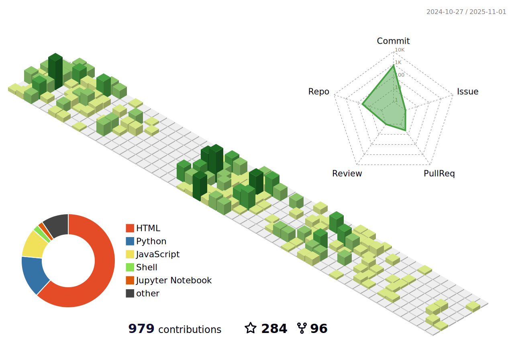

<h1 align="center">Hi 👋, (You can call me Panda 🐼)</h1>

  

<h3 align="center">Analysis, I believe, is key to any protocol. We as a community have tons of data lying around, which must be made sense of. Here is how I contribute:</h3>

  

- 🔭 I’m currently working as a Bioinformatician/Data Scientist at the German Cancer Research Center (DKFZ), Heidelberg, Germany 

- 🌱 I’m currently learning **NextFlow, Snakemake,  Docker, Singularity and AWS MultiOmics**

- 👯 I’m looking to collaborate on **bioinformatics projects (NGS, Drug discovery Pipelines)**

- 🤝 I’m looking for help with **frontend development**

- 👨‍💻 All of my projects are available at [https://github.com/pritampanda15](https://github.com/pritampanda15)

- 💬 Ask me about **R, Python, NGS, Siesta, Gromacs, Molecular docking/dynamics**

- 📫 How to reach me **pritampkp15@gmail.com**

- ⚡ Fun fact **I love Gaming**

  

  

<h3 align="left">Connect with me:</h3>

<h3 align="left">Languages and Tools:</h3>

               </a>  

&nbsp;

### 🔝 Top Contributed Repo

### 🔝 Youtube Stats

<h3 align="left">Support:</h3>

  

<h3 align="left">Time spent on my page:</h3>

